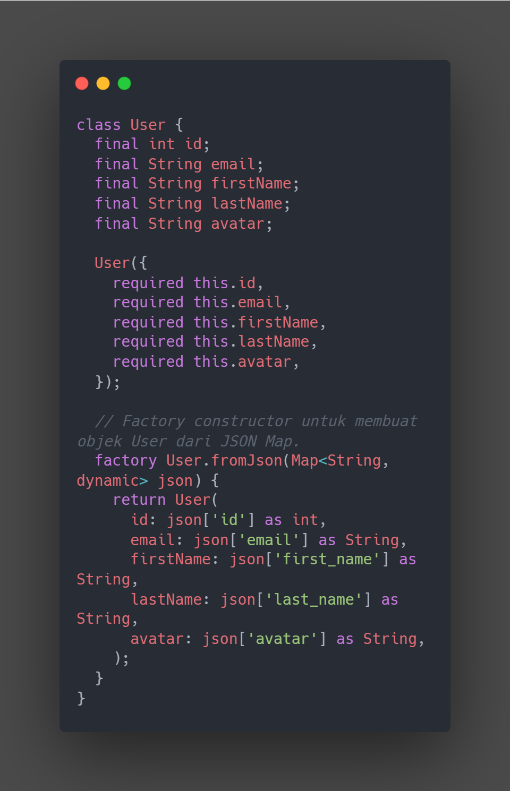
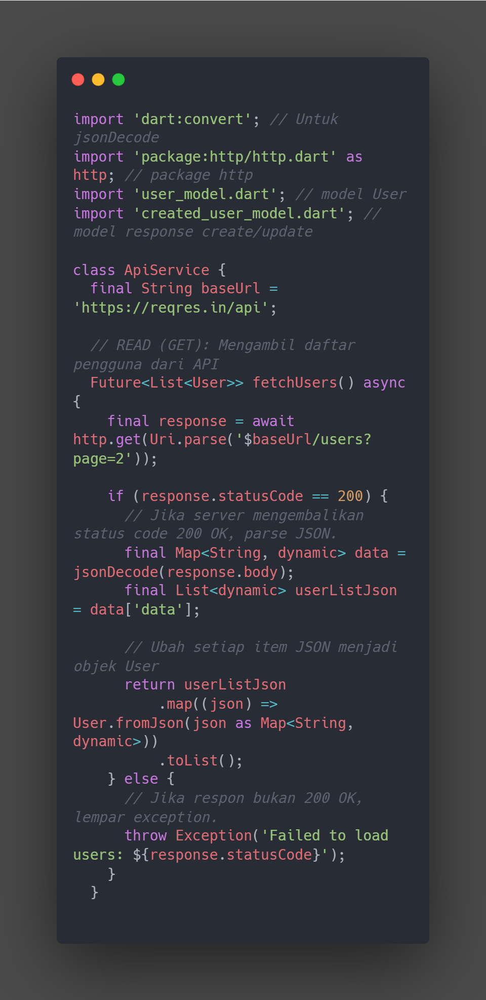
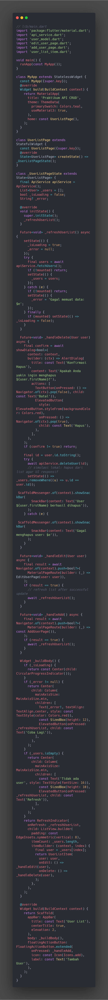
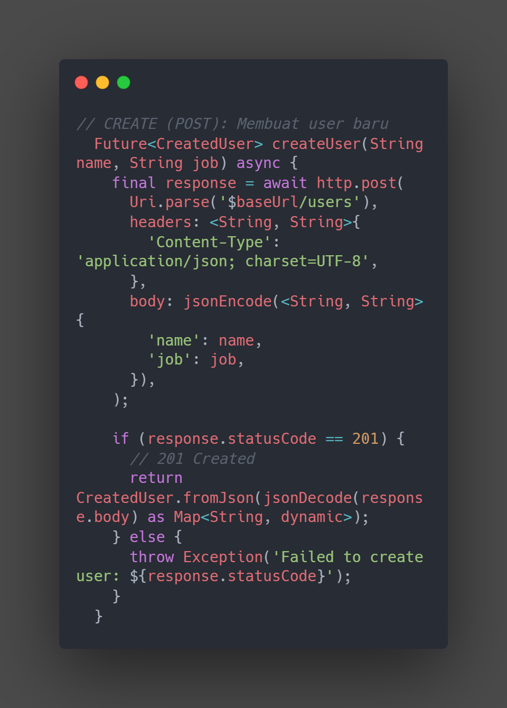
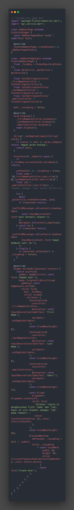
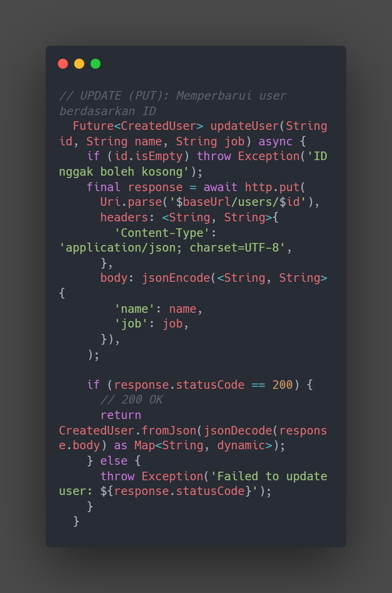

<<<<<<< HEAD
# praktikum_api_crud
=======

## Tujuan Pembelajaran 
1. Memahami konsep dasar API (Application Programming Interface) dan REST API.
 2. Menggunakan package http di Flutter untuk melakukan permintaan (request) ke API eksternal.
 3. Melakukan operasi CRUD (Create, Read, Update, Delete) terhadap data melalui API.
 4. Mengurai data JSON (parsing) dan mengubahnya menjadi objek Dart (Model). 
5. Menampilkan data dari API ke dalam UI Flutter menggunakan widget seperti ListView.
 6. Mengimplementasikan styling dasar pada komponen UI untuk menyajikan data den gan rapi.
 7. Mengelola state secara sederhana untuk menangani data yang bersifat asinkron (asynchronous).

 ## Dasar Teori 
1.  Apa itu API?
 API (Application Programming Interface) adalah seperangkat definisi, protokol, dan tools untuk membangun perangkat lunak aplikasi. Dalam praktikum ini, API bertin dak sebagai jembatan yang memungkinkan aplikasi Flutter (klien) Anda berkomunikasi dengan server (backend) untuk mengambil atau mengirim data.
 2.  REST API
 REST (Representational State Transfer) adalah gaya arsitektur yang paling umum digunakan untuk membuat API berbasis web. REST API menggunakan metode HTTP standar untuk melakukan operasi pada resources. Berikut adalah gambaran metode HTTPstandar yang digunakan dalam operasi CRUD:

3.  JSON (JavaScript Object Notation)
 JSON adalah format pertukaran data yang ringan dan mudah dibaca manusia serta di parsing oleh mesin. Hampir semua REST API menggunakan JSON sebagai format data utama.

 ## langkah-langkah 
 1. Buat Proyek Flutter
 
 2. Tambahkan Package http: Buka file pubspec.yaml dan tambahkan http di bawah bagian dependencies
 
3. Instal Package: Jalankan perintah flutter pub get di terminal
4. Membuat Model Data (User Model)

5. Membaca Data (READ - GET Request)
Buat lib/api_service.dart dan implementasikan metode fetchUsers, lalu integrasikan ke main.dart menggunakan FutureBuilder.

6. Buat UserListPage (StatefulWidget) di lib/main.dart untuk menampilkan data menggunakan FutureBuilder dan fungsi refresh _refreshUserList()

7. JalankanaplikasiAnda(flutter run).Andaakanmelihatdaftarpengguna.

8. Membuat Data (CREATE - POST Request)

9.   Buat file baru bernama add_user_page.dartdidalamfolderlib/.

 10. Implementasi UPDATE (PUT Request)
 
 
>>>>>>> 2c9dcb9 (baru)
