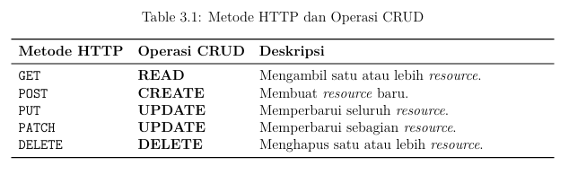
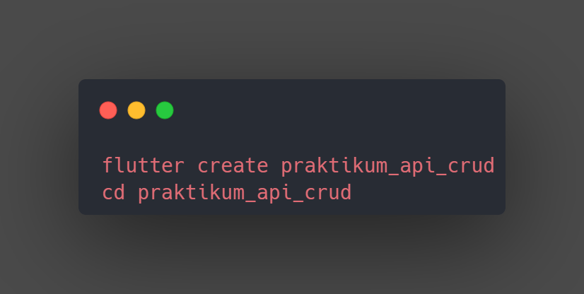
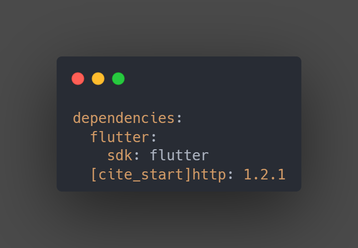

NAMA  : INANDIAR SHARFINAFAUZI
NIM   : 362458302078
KELAS : TRPL 2B 
# praktikum_api_crud
## Tujuan Pembelajaran 
1. Memahami konsep dasar API (Application Programming Interface) dan REST API.
2. Menggunakan package http di Flutter untuk melakukan permintaan (request) ke API eksternal.
3. Melakukan operasi CRUD (Create, Read, Update, Delete) terhadap data melalui API.
4. Mengurai data JSON (parsing) dan mengubahnya menjadi objek Dart (Model). 
5. Menampilkan data dari API ke dalam UI Flutter menggunakan widget seperti ListView.
6. Mengimplementasikan styling dasar pada komponen UI untuk menyajikan data den gan rapi.
7. Mengelola state secara sederhana untuk menangani data yang bersifat asinkron (asynchronous).

 ## Dasar Teori 
1.  Apa itu API?
 API (Application Programming Interface) adalah seperangkat definisi, protokol, dan tools untuk membangun perangkat lunak aplikasi. Dalam praktikum ini, API bertin dak sebagai jembatan yang memungkinkan aplikasi Flutter (klien) Anda berkomunikasi dengan server (backend) untuk mengambil atau mengirim data.
 2.  REST API
 REST (Representational State Transfer) adalah gaya arsitektur yang paling umum digunakan untuk membuat API berbasis web. REST API menggunakan metode HTTP standar untuk melakukan operasi pada resources. Berikut adalah gambaran metode HTTPstandar yang digunakan dalam operasi CRUD:

3.  JSON (JavaScript Object Notation)
 JSON adalah format pertukaran data yang ringan dan mudah dibaca manusia serta di parsing oleh mesin. Hampir semua REST API menggunakan JSON sebagai format data utama.

 ## Langkah-langkah implementasi (disertai screenshot hasil setiap bagian penting).
 ### langkah 1 Buat Proyek Flutter
 **Membuat proyek Flutter baru lalu Tambahkan Package http:** Buka file pubspec.yaml dan tambahkan http di bawah bagian dependenci
 
 
 ### langkah 2 
 - **user_model.dart** (Model Data)
 Digunakan untuk menyimpan struktur data user dari API. Fungsinya untuk mengubah   
 data JSON yang diambil dari API menjadi objek Dart agar mudah digunakan.
 -**api_service.dart** (Service API)
  Berisi fungsi-fungsi penghubung ke API, seperti fetchUsers(), CreateUsers(), UpdateUsers(), dan DeleteUsers() untuk operasi CRUD
** main.dart:**
Menampilkan daftar pengguna (UserListPage - Awalnya hanya operasi Read).
**Hasilnya**

## langkah 3
-Menambahkan halaman AddUserPage dan EditUserPage untuk operasi Create dan Update.
-Menambahkan method createUser, updateUser, dan deleteUser ke dalam file api_service.dart.
-Menambahkan file api_config.dart yang berisi konfigurasi API, termasuk baseUrl dan apiKey, agar operasi CRUD bisa berjalan
-Tampilan akhir halaman utama menampilkan daftar pengguna dengan tombol Edit dan Delete untuk setiap user, serta tombol Tambah untuk Create

**Hasilnya**
-hasil fungsi Create 

-hasil fungsi update

-Hasil fungsi delete

.

## Langkah 4
Menambahkan Fungsi File api_config.dart
api_config.dart berfungsi sebagai pusat konfigurasi yang penting untuk keberhasilan operasi CRUD API, dengan menyimpan informasi dasar seperti alamat utama API (baseUrl) dan kunci akses (apiKey). Dengan mengelola konfigurasi di satu tempat, kode menjadi fleksibel dan mudah diperbarui.

## Analisis Kode (jelaskan bagian-bagian penting dari kode Anda).
1. Model Data (User Model)
Bagian ini penting karena menjembatani format data JSON dari server ke objek Dart yang kuat (strongly-typed)

penjelasan:

- pada user class digunakan untuk mendifinisikan struktur data agar setiap data pengguna memiliki data yang jelas
  
- pada factory User.fromJson(Map<String, dynamic> json)  merupakna  Fungsi Parsing Kunci digunakan sebagai mengubah data mentahmen jadi objek yang aman.
  
2.Setelah operasi CRUD (Create, Read, Update, Delete) berhasil dijalankan, tampilan data pada aplikasi akan diperbarui secara dinamis melalui StatefulWidget.

3.Dengan bantuan FutureBuilder, proses pengambilan dan penanganan data dapat dilakukan secara asynchronous, memungkinkan aplikasi tetap berjalan tanpa gangguan saat menunggu respons dari API.

## keimpulan dan saran
Dari hasil praktikum “CRUD & Styling – Pengenalan Implementasi Dasar API Eksternal”, dapat disimpulkan bahwa mahasiswa telah memahami cara kerja API dan REST API serta mampu menerapkannya dalam aplikasi Flutter menggunakan package http. Praktikum ini juga melatih kemampuan mahasiswa dalam melakukan operasi CRUD, mengolah data JSON, menampilkan data ke antarmuka aplikasi dengan tampilan yang rapi, serta menambahkan validasi dan penanganan error. Untuk pengembangan berikutnya, disarankan agar aplikasi dibuat dengan struktur yang lebih terorganisir seperti menggunakan arsitektur Provider atau MVC, menambahkan elemen animasi dan tema yang lebih menarik, serta mencoba membuat dan menghubungkan API buatan sendiri guna memperdalam pemahaman tentang interaksi antara client dan server.

 

 

 
 
>>>>>>> 2c9dcb9 (baru)
